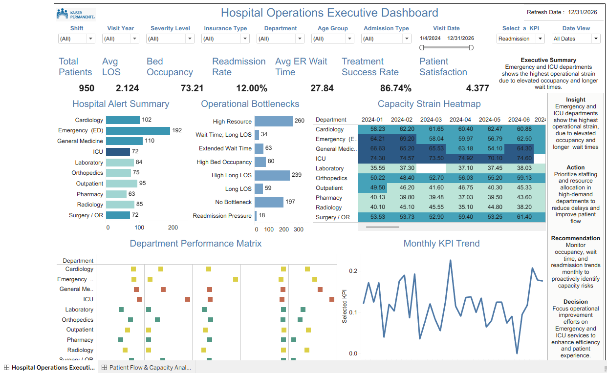
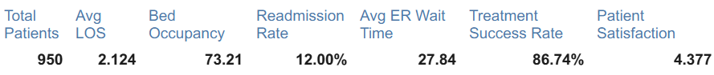
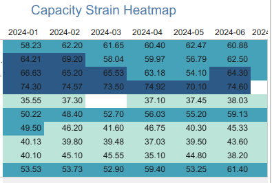
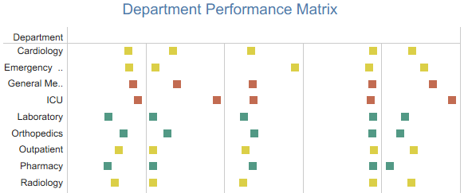
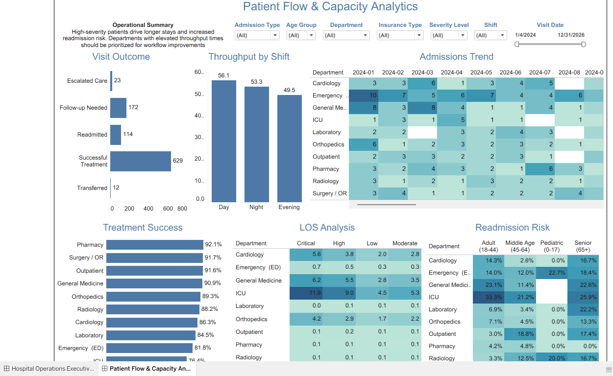
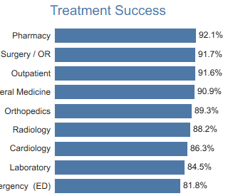
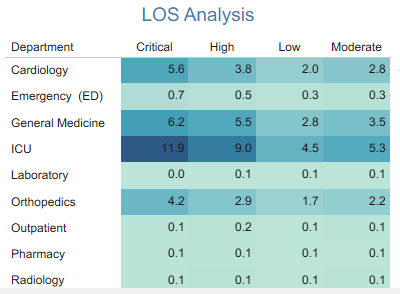
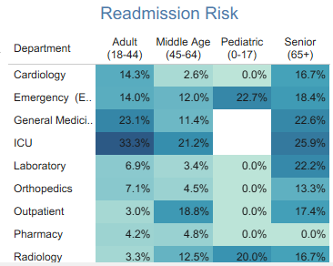

# 🏥 Hospital Operations Analytics

## Live Dashboard

**Tableau Public:**
https://public.tableau.com/app/profile/denis.king

---

## Executive Summary

Hospital leaders must continuously monitor patient flow, capacity utilization, operational bottlenecks, and care outcomes to maintain efficient healthcare delivery.

This project provides an executive-level hospital operations dashboard designed to answer one key business question:

> **Where are operational bottlenecks, capacity issues, and performance risks across the hospital?**

The solution combines operational KPIs, department performance monitoring, capacity strain analysis, patient flow analytics, and readmission tracking to support data-driven decision-making.

---

## Business Problem

Hospitals face ongoing challenges related to:

* High bed occupancy rates
* Emergency Department congestion
* Patient throughput delays
* Readmission pressure
* Capacity strain across departments
* Resource allocation inefficiencies

Without centralized reporting, leadership teams may struggle to quickly identify operational risks and prioritize improvement initiatives.

This dashboard was developed to provide visibility into hospital performance, patient flow efficiency, and operational bottlenecks across multiple service lines.

---

## Dataset

### Source

Synthetic Healthcare Operations Dataset

### Records

950 Patient Encounters

### Time Period

2024 – 2026

### Departments

* Emergency Department (ED)
* ICU
* Surgery / OR
* Cardiology
* Radiology
* Pharmacy
* Laboratory
* Orthopedics
* General Medicine
* Outpatient / Ambulatory Care

### Data Type

Portfolio-safe synthetic healthcare data.

---

## Executive KPIs

The Executive Dashboard monitors:

* Total Patients
* Average Length of Stay (LOS)
* Bed Occupancy Rate
* Readmission Rate
* Average ER Wait Time
* Treatment Success Rate
* Patient Satisfaction Score

---

# Dashboard 1: Hospital Operations Executive Dashboard



### Key Components

* Executive KPI Scorecard
* Hospital Alert Summary
* Operational Bottleneck Analysis
* Capacity Strain Heatmap
* Department Performance Matrix
* Monthly KPI Trend Analysis
* Executive Decision Support Summary

### Executive KPI Scorecard



### Capacity Strain Heatmap



### Department Performance Matrix



---

# Dashboard 2: Patient Flow & Capacity Analytics



### Key Components

* Admissions Trend
* Throughput Analysis
* Visit Outcome Distribution
* Treatment Success Monitoring
* Length of Stay Analysis
* Readmission Risk Analysis

### Treatment Success



### Length of Stay Analysis



### Readmission Risk



---

## Key Insights

### Insight

Emergency Department and ICU services exhibit the highest operational strain due to elevated occupancy levels and longer wait times.

### Action

Prioritize staffing and resource allocation within high-demand departments to reduce delays and improve patient flow.

### Recommendation

Monitor occupancy, wait time, and readmission trends monthly to proactively identify capacity risks.

### Decision

Focus operational improvement efforts on Emergency and ICU services to enhance efficiency and patient experience.

---
# Business Impact

This dashboard supports hospital leadership by transforming operational data into actionable insights that improve resource planning and patient care delivery.

### Operational Benefits

* Identifies high-strain departments requiring staffing and resource allocation adjustments.
* Monitors bed occupancy, patient throughput, and wait times to support capacity planning.
* Tracks readmission trends to highlight patient populations and departments requiring intervention.
* Improves visibility into Length of Stay (LOS) drivers across severity levels and departments.
* Supports executive decision-making through centralized KPI monitoring and operational performance reporting.

### Business Value

* Enables proactive identification of operational bottlenecks.
* Supports data-driven capacity management and workflow optimization.
* Improves hospital performance monitoring and reporting efficiency.
* Enhances patient flow visibility across departments.
* Provides a scalable framework for healthcare operational analytics and decision support.


---

## Skills Demonstrated

### Healthcare Analytics

* Hospital Operations Analytics
* Patient Flow Analysis
* Readmission Monitoring
* Capacity Planning
* Length of Stay Analysis
* Healthcare KPI Reporting

### Business Intelligence

* Tableau Dashboard Development
* Executive Reporting
* Performance Monitoring
* Decision Support Analytics
* Operational Reporting

### Data Analytics

* KPI Design
* Trend Analysis
* Heatmap Visualization
* Department Benchmarking
* Performance Measurement

---

## Tools Used

* Tableau
* SQL
* Excel
* CSV Data Modeling
* Healthcare KPI Reporting

---

## Repository Structure

```text
Hospital-Operations-Analytics/

├── data/
│   └── healthcare_operations_dashboard_950_rows_final.csv

├── screenshots/
│   ├── hero_dashboard1.png
│   ├── kpi_scorecard.png
│   ├── capacity_strain_heatmap.png
│   ├── department_performance_matrix.png
│   ├── readmission_risk.png
│   ├── los_analysis.png
│   └── treatment_success.png

├── tableau/
│   └── Hospital_Operations_Analytics.twbx

└── README.md
```

---

## Disclaimer

This project was created for educational and portfolio purposes only.

The dataset is synthetic, contains no protected health information (PHI), and is not affiliated with or endorsed by Kaiser Permanente.
